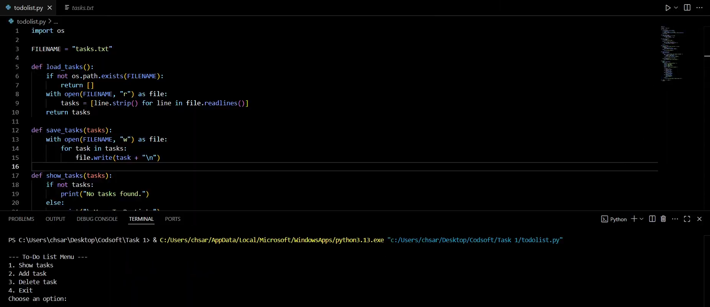

# Task 1 - To-Do List Application

## 📌 Overview

This is a simple **To-Do List** project made for my **CodSoft Python Programming Internship**.
It helps users manage daily tasks using a basic Python command-line program.
## 📌 Overview

This is a simple **To-Do List** project made for my **CodSoft Python Programming Internship**.  
It helps users manage daily tasks using a basic Python command-line program.

---

## ✅ Features

- View all tasks
- Add new tasks
- Delete tasks
- Tasks are saved in a file (`tasks.txt`)

---

## ⚙️ How It Works

- The app saves tasks in a `tasks.txt` file in the same folder.
- You can add, see, or remove tasks anytime.
- When you run it again, your tasks will still be there.

---

## 🚀 How to Run

1. Make sure Python 3 is installed.
2. Open a terminal in this folder.
3. Run the file:
4. Use the menu to manage your tasks.

---

## ✨ What I Learned

- File handling in Python
- Lists and loops
- Making simple user menus

---

## 📌 Tags

#codsoft #internship #python #todolist

---

**Thank you for reading!**

