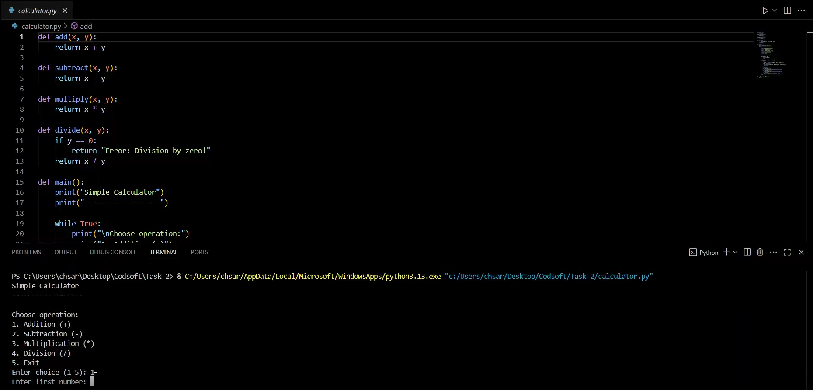

# Task 2 - Calculator

## 📌 Overview

This is a simple **To-Do List** project made for my **CodSoft Python Programming Internship**.
It helps users manage daily tasks using a basic Python command-line program.
## 📌 Overview

This is a simple **Calculator** project developed for my **CodSoft Python Programming Internship**.  
It allows the user to perform basic arithmetic operations through the command line.

---

## ✅ Features

- Addition
- Subtraction
- Multiplication
- Division (with division by zero handling)
- Simple, clear menu for user input
- Runs continuously until the user exits

## ✨ What I Learned

- How to create simple functions in Python.
- Handling user input and validating it.
- Using loops and conditional statements for menu-driven programs.

---

## 📌 Tags

#codsoft #internship #python #calculator

---

Thank you for checking it out!
